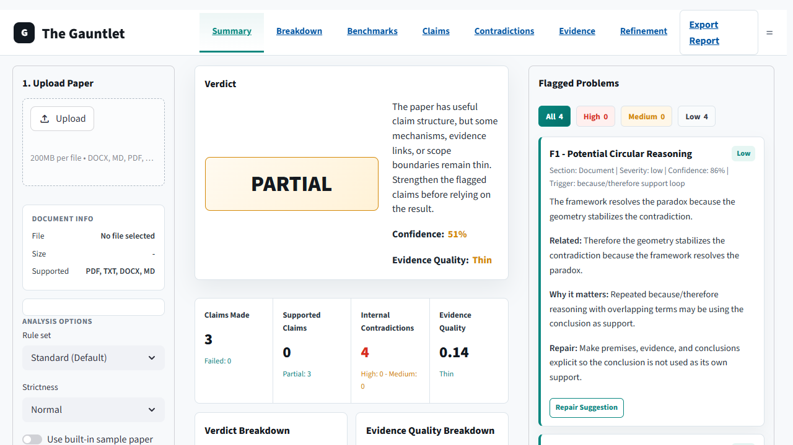
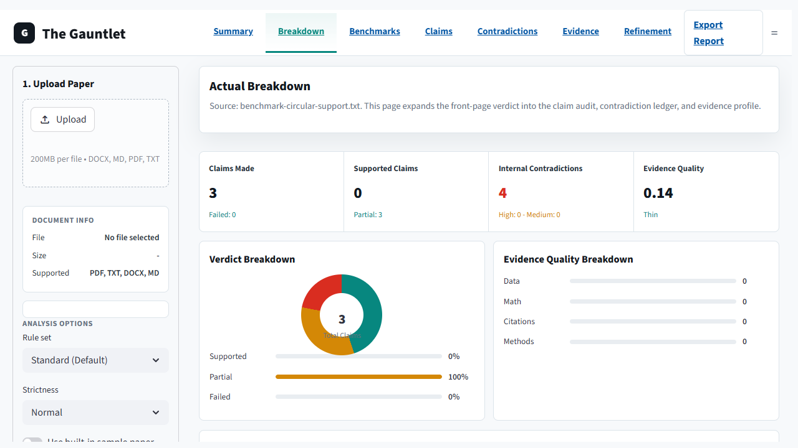
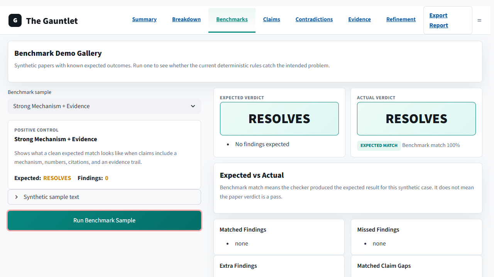
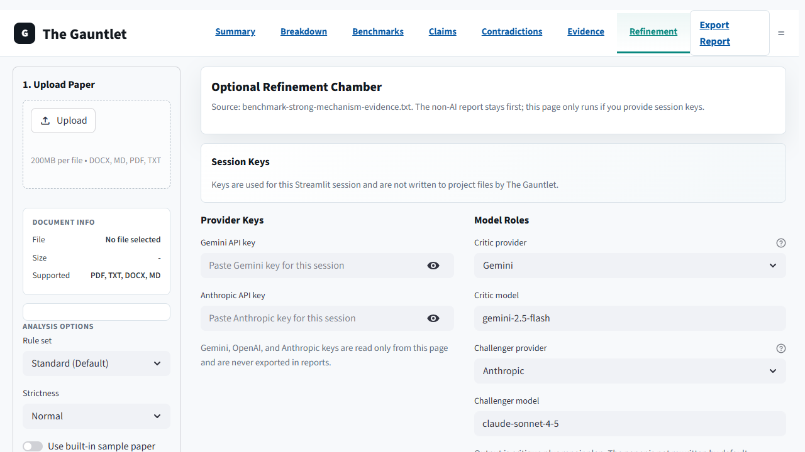

# The Gauntlet

The Gauntlet is a local-first paper checker for stress-testing theories,
papers, and arguments. Upload a document and it produces a transparent
rule-based verdict: `RESOLVES`, `PARTIAL`, `FAILS`, or
`CREATES_NEW_PARADOXES`.

## Download ZIP -> Double-Click -> Upload Paper

1. Click GitHub's green `Code` button.
2. Choose `Download ZIP`.
3. Unzip the folder.
4. Double-click `Start-Gauntlet.bat`.
5. Upload a `.pdf`, `.docx`, `.txt`, or `.md` paper and press `Analyze Paper`.

The default flow does not call any AI provider. There is no API key setup for
the normal checker. The app runs on your machine and uses deterministic rules
for section parsing, claim extraction, contradiction checks, mechanism checks,
evidence linking, and verdict scoring.

**Privacy note:** the normal checker runs locally and does not require an API
key. Optional AI refinement only runs when you paste a session key on the
`Refinement` page.

## Screenshots









## Quick Start on Windows

1. Download this repo from GitHub.
2. Unzip it.
3. Double-click `Start-Gauntlet.bat`.
4. Upload a `.pdf`, `.docx`, `.txt`, or `.md` paper.
5. Press `Analyze Paper`.

The launcher creates a local `.venv`, installs the requirements, and opens the
Streamlit app in your browser.

## Manual Start

```bash
python -m venv .venv
.venv\Scripts\python -m pip install -r requirements.txt
.venv\Scripts\python -m streamlit run app.py
```

On macOS or Linux, use the equivalent activation path for your shell.

## What the Verdict Means

- `RESOLVES`: the paper's detected claims include mechanisms and enough
  evidence markers to pass the v2 rule checks.
- `PARTIAL`: the paper has useful claim structure, but some mechanisms,
  evidence, or specificity are thin.
- `FAILS`: the rules did not find enough explicit claim, mechanism, and
  evidence support.
- `CREATES_NEW_PARADOXES`: the rules found a high-severity internal
  contradiction.

The verdict is a review aid, not a replacement for expert peer review.

## What V2 Checks

- document sections and claim locations
- explicit resolution claims
- mechanism language such as `because`, `through`, `via`, `framework`, or
  `equation`
- evidence markers and evidence links such as data, observations, citations,
  numbers, equations, methodology terms, and statistical language
- internal contradictions, direct negations, property mismatches, universal
  counterexamples, and temporal conflicts
- repair barriers such as unsupported resolution claims, missing mechanisms,
  evidence gaps, scope conflicts, circular support, and theory-as-fact wording
- exportable JSON and Markdown reports

## Benchmark Demo Gallery

The `Benchmarks` page contains synthetic mini papers with known expected
outcomes. These samples are not real papers and are not claims about any real
author. They are calibration cases that show what the deterministic rules are
supposed to catch.

Current benchmark cases cover:

- strong mechanism and evidence
- weak evidence
- no clear resolution claims
- unsupported resolution claims
- internal contradiction
- scope conflict
- circular support
- theory-as-fact language

Each benchmark shows the expected verdict, actual verdict, matched findings,
missed findings, extra findings, matched claim gaps, and export buttons. The
same benchmark corpus is used by the test suite so future rule changes cannot
quietly break known behavior.

## Optional Refinement Chamber

The `Refinement` page is optional. It lets a user paste session-only Gemini,
OpenAI, or Anthropic API keys, then runs a visible two-model critique:

1. The deterministic Gauntlet report creates an issue brief.
2. The selected critic provider proposes a critique and repair plan.
3. The selected challenger provider challenges weak repairs, assumptions, and unresolved issues.
4. The combined repair plan is re-checked by the deterministic Gauntlet rules.

The app shows the prompts, returned model messages, disagreements, repair plan,
and re-check result. It does not ask for hidden model reasoning and it does not
save API keys to project files.

Gemini is available as a first-class option for people who want a
free-tier-friendly provider. Current Gemini pricing, rate limits, and available
models can change, so check the official Google AI Studio/Gemini API pages
before relying on a specific quota.

The Windows launcher does not install AI packages. Install optional AI
dependencies only if you want this page to run live:

```bash
.venv\Scripts\python -m pip install -r requirements-ai.txt
```

API keys are session-only. They are not written to project files and are not
included in JSON or Markdown exports.

## Legacy Colab Versions

The older Colab/prototype files are preserved in `legacy/colab-originals/`.
They are still available for people who want the original notebook-style
experiments or AI-wired versions.

## Development

```bash
python -m pip install -r requirements-dev.txt
pytest
```

The public Python entry point is:

```python
from gauntlet_core import analyze_paper_text

report = analyze_paper_text("Your paper text here", source_name="paper.txt")
print(report.verdict)
print(report.to_json())
```

Benchmark samples and optional refinement can be imported separately:

```python
from gauntlet_core import analyze_paper_text, list_benchmark_samples, run_benchmark_sample, run_refinement
from gauntlet_core.refinement import ProviderSelection, run_provider_refinement

for sample in list_benchmark_samples():
    print(sample.id, run_benchmark_sample(sample.id).passed)

report = analyze_paper_text(paper_text, source_name="paper.txt")
refinement = run_refinement(report, paper_text, openai_api_key="...", anthropic_api_key="...")
print(refinement.repair_plan)

gemini_refinement = run_provider_refinement(
    report,
    paper_text,
    critic=ProviderSelection("critic", "Gemini", "gemini-2.5-flash", "..."),
    challenger=ProviderSelection("challenger", "Gemini", "gemini-2.5-flash", "..."),
)
print(gemini_refinement.repair_plan)
```

## License

This project uses the Motion-TimeSpace Non-Commercial License. See `LICENSE`.
