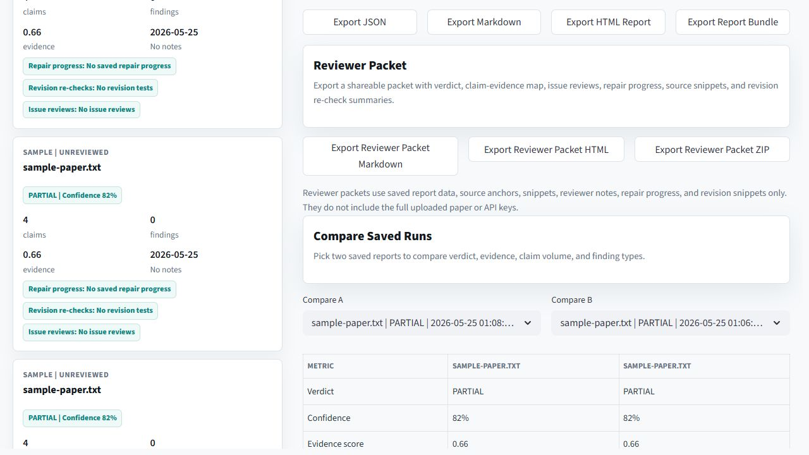
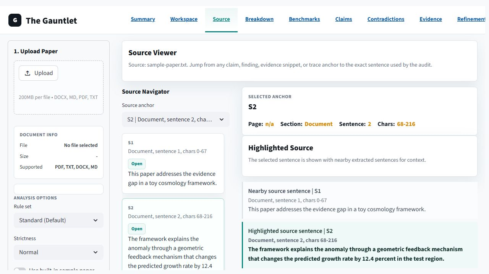

# The Gauntlet

The Gauntlet is a local-first paper checker for stress-testing theories,
papers, and arguments. Upload a document and it produces a transparent
rule-based verdict: `RESOLVES`, `PARTIAL`, `FAILS`, or
`CREATES_NEW_PARADOXES`.

## Download ZIP -> Double-Click -> Upload Paper

1. Click GitHub's green `Code` button.
2. Choose `Download ZIP`.
3. Unzip the folder.
4. Double-click `Start-Gauntlet.bat`.
5. Upload a `.pdf`, `.docx`, `.txt`, or `.md` paper and press `Analyze Paper`.

The default flow does not call any AI provider. There is no API key setup for
the normal checker. The app runs on your machine and uses deterministic rules
for section parsing, claim extraction, contradiction checks, mechanism checks,
evidence linking, and verdict scoring.

**Privacy note:** the normal checker runs locally and does not require an API
key. Optional AI refinement only runs when you paste a session key on the
`Refinement` page.

Completed analyses auto-save to `.gauntlet/workspace/runs/` inside the repo
folder so you can reopen reports, compare runs, and add reviewer notes. The
workspace stores report JSON, source anchors, snippets, and notes, but not the
uploaded paper file or API keys. If your repo folder lives inside OneDrive,
Dropbox, or another synced folder, those local report files may still sync
through that service.

## Screenshots







## Quick Start on Windows

1. Download this repo from GitHub.
2. Unzip it.
3. Double-click `Start-Gauntlet.bat`.
4. Upload a `.pdf`, `.docx`, `.txt`, or `.md` paper.
5. Press `Analyze Paper`.

The launcher creates a local `.venv`, installs the requirements, and opens the
Streamlit app in your browser.

You can also drag a paper or folder onto `Analyze-Paper.bat` to write reports
without opening the app.

## Manual Start

```bash
python -m venv .venv
.venv\Scripts\python -m pip install -r requirements.txt
.venv\Scripts\python -m streamlit run app.py
```

On macOS or Linux, use the equivalent activation path for your shell.

## Analyze Without Opening the UI

For a quick one-file or folder check, drag a `.pdf`, `.docx`, `.txt`, `.md`, or
folder onto `Analyze-Paper.bat`. It installs only the local non-AI requirements,
runs the deterministic checker, and writes JSON, Markdown, HTML, CSV, and ZIP
bundle reports to `gauntlet-reports/`.

The same path is available from the command line:

```bash
.venv\Scripts\python -m gauntlet_core.cli path\to\paper.pdf --out gauntlet-reports
.venv\Scripts\python -m gauntlet_core.cli path\to\papers --out gauntlet-reports
```

## What the Verdict Means

- `RESOLVES`: the paper's detected claims include mechanisms and enough
  evidence markers to pass the v2 rule checks.
- `PARTIAL`: the paper has useful claim structure, but some mechanisms,
  evidence, or specificity are thin.
- `FAILS`: the rules did not find enough explicit claim, mechanism, and
  evidence support.
- `CREATES_NEW_PARADOXES`: the rules found a high-severity internal
  contradiction.

The verdict is a review aid, not a replacement for expert peer review.

## What V2 Checks

- document sections and claim locations
- explicit resolution claims
- false-positive guardrails for tentative hypotheses, prior-work comparisons,
  scoped limitations, reference-like text, and unsupported equation/citation
  dumps
- mechanism language such as `because`, `through`, `via`, `framework`, or
  `equation`
- evidence markers and evidence links such as data, observations, citations,
  numbers, equations, methodology terms, and statistical language
- internal contradictions, direct negations, property mismatches, universal
  counterexamples, and temporal conflicts
- repair barriers such as unsupported resolution claims, missing mechanisms,
  evidence gaps, scope conflicts, circular support, and theory-as-fact wording
- source trace anchors for claims, findings, contradictions, and evidence
  snippets, including PDF page numbers when available
- a Source Review page that highlights the exact extracted sentence behind a
  claim, finding, evidence snippet, repair item, or source-trace anchor
- exportable JSON, Markdown, self-contained HTML, and report bundle ZIP exports
- a Repair Workshop that turns claim gaps and findings into prioritized repair
  steps with local saved progress and revision re-checks

## Benchmark Demo Gallery

The `Benchmarks` page contains synthetic mini papers with known expected
outcomes. These samples are not real papers and are not claims about any real
author. They are calibration cases that show what the deterministic rules are
supposed to catch.

Current benchmark cases cover:

- strong mechanism and evidence
- weak evidence
- no clear resolution claims
- unsupported resolution claims
- internal contradiction
- scope conflict
- circular support
- theory-as-fact language
- tentative hypotheses that should not be treated as finished resolutions
- scoped limitations and prior-work comparisons that should not become
  internal contradictions
- reference-like text, weak equation dumps, and caveated universal claims that
  should not create false-positive findings

Each benchmark shows the expected verdict, actual verdict, matched findings,
missed findings, extra findings, matched claim gaps, and false-positive
guardrail checks for findings and claim gaps that should stay absent. The same
benchmark corpus is used by the test suite so future rule changes cannot
quietly break known behavior or reintroduce known false positives.

## Local Saved Workspace

The `Workspace` page keeps a private local history of completed analyses. Use it
to reopen a previous report, export JSON, Markdown, HTML, or a report bundle
ZIP again, add reviewer notes, mark review status, resume repair progress,
delete a saved run, or compare two saved reports side by side.

Saved workspace files live under `.gauntlet/workspace/runs/` and are ignored by
Git. The app saves the deterministic report, source snippets, reviewer notes,
repair progress, and pasted revision snippets needed for auditability, but it
does not save the original uploaded document.

## Batch Scan

The `Batch` page lets you upload several papers at once and produces a verdict
table with confidence, evidence score, claim count, finding count, and top risk
types. Export the table as CSV or download a batch ZIP bundle containing the
summary, an offline `index.html` dashboard, and individual JSON, Markdown, and
HTML reports for each analyzed paper. Use the filter and sort controls to focus
on `FAILS`, `CREATES_NEW_PARADOXES`, high-risk papers, weak evidence, most
findings, or low confidence before exporting.

Use `Load Demo Batch` to run the built-in synthetic benchmark papers as a
ready-made batch scan. It is useful for testing the table, filters, sorting, and
exports before uploading private documents.

## Share Demo Kit

The `Share Demo` page generates a public demo ZIP for posting project updates.
It includes an X post draft, a longer thread draft, screenshot-ready HTML/SVG
cards, demo batch summaries, and the full offline demo batch bundle. The kit is
generated from synthetic benchmark papers only.

## Repair Workshop

The `Repair Workshop` page turns the deterministic audit into a fix-first
checklist. It prioritizes high-severity findings, unsupported claims, missing
mechanisms, weak evidence links, scope gaps, and low evidence coverage. You can
mark each step as `To Do`, `In Progress`, `Fixed`, `Won't Fix`, or
`False Positive`, add reviewer notes, save progress to the local workspace, and
export a Markdown repair checklist.

Each repair step also includes a revision re-check box. Paste a revised
sentence or paragraph, run the deterministic re-check, and The Gauntlet will
show whether the snippet `Improved`, is `Still Weak`, or `Introduces New Issue`.
Saved re-checks are stored locally as snippets and audit results, then exported
through the Revision Re-Check Log.

The older `?page=action` link still opens this page, and static reports still
include the original reviewer action plan for offline reading.

## Source Review

The `Source Review` page turns source anchors into an issue-led audit view.
Open it from the nav or from any `View Source` link on a claim, finding,
evidence card, action item, or source-trace card. Start from the issue queue,
filter by findings, claims, evidence, high risk, or repair needs, then inspect
the highlighted sentence with nearby extracted context, linked audit items, rule
explanations, and repair suggestions. Source Review exports include references
and snippets only, not full uploaded paper files.

## Optional Refinement Chamber

The `Refinement` page is optional. It lets a user paste session-only Gemini,
OpenAI, or Anthropic API keys, then runs a visible two-model critique:

1. The deterministic Gauntlet report creates an issue brief.
2. The selected critic provider proposes a critique and repair plan.
3. The selected challenger provider challenges weak repairs, assumptions, and unresolved issues.
4. The combined repair plan is re-checked by the deterministic Gauntlet rules.

The app shows the prompts, returned model messages, disagreements, repair plan,
and re-check result. It does not ask for hidden model reasoning and it does not
save API keys to project files.

Gemini is available as a first-class option for people who want a
free-tier-friendly provider. Current Gemini pricing, rate limits, and available
models can change, so check the official Google AI Studio/Gemini API pages
before relying on a specific quota.

The Windows launcher does not install AI packages. Install optional AI
dependencies only if you want this page to run live:

```bash
.venv\Scripts\python -m pip install -r requirements-ai.txt
```

API keys are session-only. They are not written to project files and are not
included in JSON or Markdown exports.

## Legacy Colab Versions

The older Colab/prototype files are preserved in `legacy/colab-originals/`.
They are still available for people who want the original notebook-style
experiments or AI-wired versions.

## Development

```bash
python -m pip install -r requirements-dev.txt
pytest
```

The public Python entry point is:

```python
from pathlib import Path

from gauntlet_core import analyze_paper_text

report = analyze_paper_text("Your paper text here", source_name="paper.txt")
print(report.verdict)
print(report.to_json())
print(report.to_html())
Path("paper-gauntlet-report-bundle.zip").write_bytes(report.to_bundle_bytes())
```

Benchmark samples and optional refinement can be imported separately:

```python
from gauntlet_core import analyze_paper_text, list_benchmark_samples, run_benchmark_sample, run_refinement
from gauntlet_core.refinement import ProviderSelection, run_provider_refinement

for sample in list_benchmark_samples():
    print(sample.id, run_benchmark_sample(sample.id).passed)

report = analyze_paper_text(paper_text, source_name="paper.txt")
refinement = run_refinement(report, paper_text, openai_api_key="...", anthropic_api_key="...")
print(refinement.repair_plan)

gemini_refinement = run_provider_refinement(
    report,
    paper_text,
    critic=ProviderSelection("critic", "Gemini", "gemini-2.5-flash", "..."),
    challenger=ProviderSelection("challenger", "Gemini", "gemini-2.5-flash", "..."),
)
print(gemini_refinement.repair_plan)
```

## License

This project uses the Motion-TimeSpace Non-Commercial License. See `LICENSE`.
